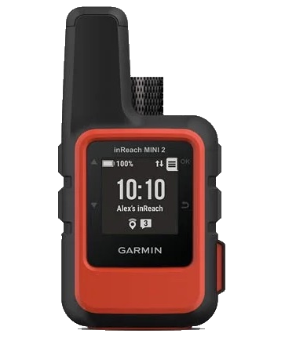
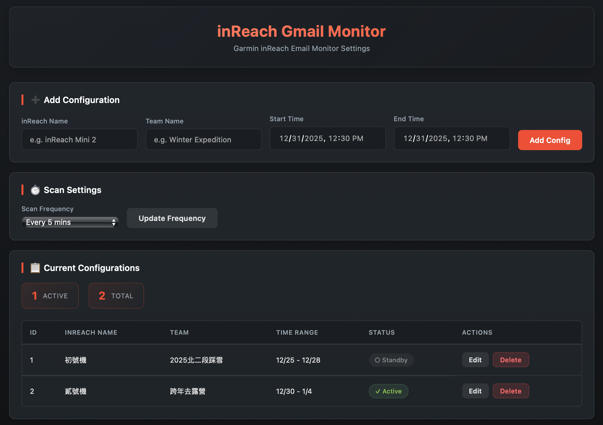

# Garmin inReach Gmail Monitor

<div align="center">
  
</div>

Automatically monitor Garmin inReach emails using Google Apps Script, parse message content, write to Google Sheets, and send real-time Line notifications. Includes a modern Web App management interface for managing teams and monitoring settings.

<div align="center">
  
</div>

## Features

- **Web App Management Interface**
  - Visual management of inReach and team settings
  - Real-time adjustment of scan frequency
- **Automatic Monitoring**
  - Automatically search for inReach emails in Gmail
  - Parse sender name, message content, and Garmin Explore links
  - Use Gmail Labels to avoid duplicate processing
- **Data Integration**
  - Automatically categorize and write to corresponding sheets based on team settings
  - Support time range settings to process messages only for active teams
- **Real-time Notifications**
  - Send real-time notifications via Line Messaging API

## Project Structure

```
inreach-gmail-line-monitor/
├── .clasp.json         # CLASP configuration
├── webapp.gs           # Web App server-side API
├── index.html          # Web App management interface
├── main.gs             # Main entry point
├── config.gs           # Config Sheet reading module
├── gmail.gs            # Gmail search and labeling module
├── parser.gs           # Email parsing module
├── sheet.gs            # Google Sheet operation module
└── line.gs             # Line Messaging API notification module
```

## Installation Steps

### 1. Install CLASP

```bash
npm install -g @google/clasp
```

### 2. Login to Google

```bash
clasp login
```

### 3. Create Google Apps Script Project

```bash
clasp create --type standalone --title "inReach Gmail Monitor"
```

This will automatically create `.clasp.json`.

### 4. Push Code

```bash
clasp push
```

### 5. Deploy Web App

1. Open Apps Script Editor
2. Click "Deploy" -> "New deployment"
3. Select "Web app"
4. Settings:
   - Execute as: Me
   - Who has access: Only myself (or adjust as needed)
5. Get the Web App URL to use the management interface

## Google Sheet Setup

1. Create a Google Sheet named `inReach_monitor`
2. The system will automatically create the required `Config` sheet and columns
3. You can also initialize settings directly via the Web App interface

## Line Bot Setup

1. Create a Channel in the [Line Developers Console](https://developers.line.biz/)
2. Get the **Channel Access Token**
3. Add the following properties in Apps Script Project Settings -> **Script Properties**:
   - `LINE_CHANNEL_ACCESS_TOKEN`
   - `LINE_USER_ID` (User ID or Group ID)

## Usage

### Via Web App (Recommended)
Open the deployed Web App URL to:
- Add/Modify/Delete inReach monitoring settings
- Adjust system scan frequency (1-30 minutes)
- View current monitoring status

### Manual Execution
Run the `scanInreachMails` function in the Apps Script Editor.

## Output Format

### Google Sheet
Automatically creates sheets named: `YYYYMMDD_TeamName`

| Column | Description |
|--------|-------------|
| timestamp | Email timestamp |
| inreach_name | inReach device name |
| team_name | Team name |
| message_text | Message content |
| explore_link | Garmin Explore link |
| gmail_message_id | Message ID |

### Line Notification

```text
inReach: {Device Name}
Team: {Team Name}
Time: {Time}
Message: {Message Content}
Link: {Link}
```

## License

**Personal Use Only / Non-Commercial**
This project is for personal learning and non-commercial use only. Commercial use without authorization is prohibited.
